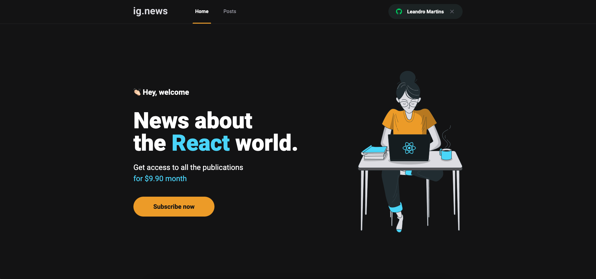

<h1 align="center">Ignews</h1>

<p align="center">
   
</p>

## :bookmark: About the project

Next.js application for the Ignews project developed at Ignite @ Rocketseat.

## 🚀 Technologies

Technologies that I used to develop this web client

- [Next.js](https://nextjs.org/)
- [Sass](https://sass-lang.com/)
- [TypeScript](https://www.typescriptlang.org/)
- [Stripe](https://stripe.com/)
- [Prismic](https://prismic.io/)
- [NextAuth.js](https://next-auth.js.org/)
- [Fauna](https://fauna.com/)
- [Axios](https://github.com/axios/axios)
- [date-fns](https://date-fns.org/)
- [ESLint](https://eslint.org/)
- [Prettier](https://prettier.io/)
- Environment variables

## 💻 Getting started

### Requirements

**Clone the project and access the folder**

```bash
$ git clone https://github.com/leolivm/ignews.git && cd ignews
```

**Follow the steps below**

```bash
# Install the dependencies
$ yarn
```

Create an `.env` file in the project's root directory

Copy the variables from the `.env.example` file and paste into `.env`, now fill in the information with your credentials

Run the project

```bash
$ yarn dev

$ stripe listen --forward-to localhost:3000/api/webhooks
```

---

Made with 💜 by Leandro Martins 👋 [See my linkedin](https://www.linkedin.com/in/leandro-martins-0640921a4/)
